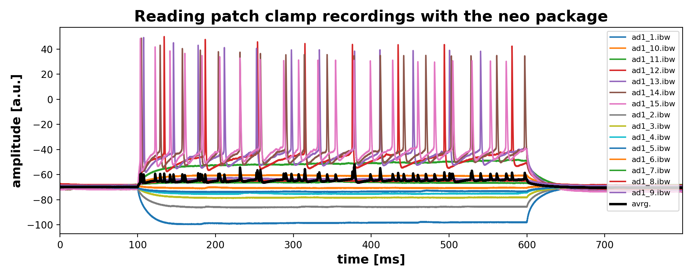

# Reading ibw-files in Pyhton

This is an example of how to read patch clamp recordings in [*WaveMetrics* _IGOR_](https://www.wavemetrics.com/products/igorpro) `*.ibw` files using the packages (required to be installed):

* [neo](http://neuralensemble.org/neo/)
* [igor](https://pypi.org/project/igor/)

